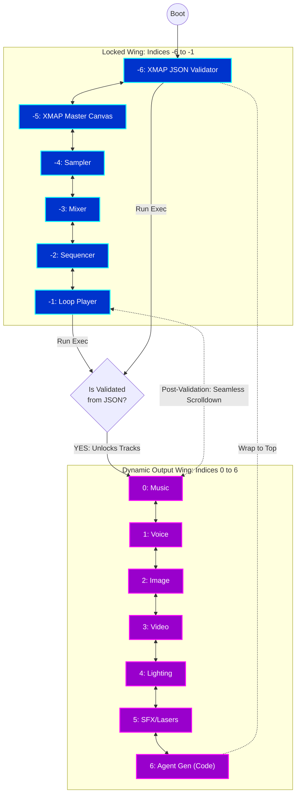

# Pow3r Platform

The Pow3r Platform is a cloud-native, edge-first workflow orchestration tool designed for seamless AI integration and visual application development.

## Core Philosophy

- **Cloud Native & Edge Deployments:** Primarily built around Cloudflare Workers, AI Gateway, Vectorize, and KV.
- **Workflow-Based Architecture:** Unified schema (JSON) representing the application UI, data workflows, self-monitoring, telemetry, and spatial computing logic (3D visualizer).
- **Unbound Themes & UIs:** Using React, Tailwind, and Radix UI in completely disconnected modular nodes.
- **AI Integrations Deep Native:** Integration with Google Cloud Gemini, Abacus.AI DeepAgents, and locally deployed WebGPU (WebLLM/Transformers.js) offline inferences.

## Latest Architecture & UX: Simple Swipe NAV
Based on recent user testing and review of conflicting gestural logics ("Swipe Down for Editors NAV"), we have overhauled the UX navigation structure. 

The application utilizes a **Simple Swipe NAV** linear looping array mapping indices `-6` to `+17`:
1. **The Editor Wing (Indices -6 to -1):** XMAP Validator, XMAP Master Canvas, Sampler, Mixer, Sequencer, Loop Player.
2. **The Track Wing (Indices 0 to 17):** Dynamic tracks including generative media (Music, Voice, Image, Video, Light, Lasers), Agent Gen, plus newly added **XMAP Builder Components** (Dance, AMCA, VMCA, MIDI, Spark Fingerprinting, Projection Mapping, Holograms, AR Presets, Mic Input, Surface Scanning, Kinematics Tracking).

This logic has been physically codified as `node-user-journey-nav` within our internal Unified Canvas map.

### XMAP Builder Components
The platform acts as an organic engine that builds itself. By parsing the underlying `XMAP_SCHEMA_V9`, the visualizer dynamically generates component tracks for new capabilities mapped directly from the workflow state. 
- **Full System Mapping:** Every UI component is strictly mapped to the application's configuration and XMAP orchestrator. Nothing exists purely "in UI"—it is unbound function-first architecture. Component states, payloads, system responses, API calls, and MCP workflows execute natively in the cloud and report to the graph.
- **X-Bugger Integration:** All UI interactions (button clicks, generations, media toggles) generate system payloads that are dispatched directly into `useWorkflowStore` and captured by `X-bugger`. Users receive actionable, user-friendly Toast notifications alongside raw JSON traces ensuring full observability.
- **Component Map & Active Integrations:** Integrated Builder Components include `node-amca`, `node-amca-vis`, `node-agent-sandbox`, `node-builder-ar-presets`, `node-builder-dance`, `node-data-router`, `node-global-media`, `node-hologram`, `node-builder-image`, `node-builder-kinetix`, `node-builder-light`, `node-builder-music`, `node-builder-sfx`, `node-builder-video`, `node-builder-voice`, `node-mic-recorder`, `node-builder-midi`, `node-mixer`, `node-pip-player`, `node-pow3r-control`, `node-projection-mapper`, `node-sampler-editor`, `node-spark`, `node-stage-builder`, `node-surface-scanner`, `node-video-tracking`, `node-vmca`.

### The Runtime Gate
By default, the platform boots at `-6` (XMAP JSON). Users cycle vertically between `-6` and `-1` (the Editors). Upon executing the runtime inside the validator (`isValidated` mode), the **Runtime Gate unlocks**, expanding the accessible indices to include the full track spectrum `[-6, 17]`. The user is immediately dispatched to index `0` (Music track) to view the generated assets and can scrub naturally down through the UI.

- **Up Arrow / Swipe Up:** Decrement index (moves back in loop).
- **Down Arrow / Swipe Down:** Increment index (moves forward in loop).

### User Journey Diagram: The Linear Loop

## Core Application Areas

### 1. Unified Schema Canvas (XMAP Master Canvas)
Built using `React Flow`, it visualizes every part of your architecture including:
- **Core Nodes:** UIs, internal components, Observers, and standard React nodes.
- **Platform Nodes:** Cloudflare, Google Cloud, Abacus.AI instances.
- **Guardian Nodes:** For policy enforcement, output bounding, and content filtering.

### 2. The Pow3r Surface Area (Slide Looper)
The interactive interface that simulates the "production output" of the visual flow map.
Features include:
- **Audio Generation (Lyria/RIFFY):** Interfaces with Google GenAI / Lyria backend workflows. Or seamless toggles to WebLLM/ONNX for local inferences. Automatically infers contextual metadata using `gemini-3.1-flash-lite-preview`.
- **Real-time Sequencer:** Drag and drop sequential JSON elements. 
- **Expert Abacus DeepAgent Chat:** Real-time production intelligence using *Gemini*.
- **Guardian Audit:** Evaluates state output through local LLM policies and dispatches events to telemetry pipelines. Fully powered by `gemini-3.1-flash-lite-preview` schema evaluation.
- **Obsidian Cloud Vault Integration:** Imports markdown rulesets and graph maps over an active websocket.

## Services Architecture (`/src/services/`)

We have decoupled theoretical logic into modular service endpoints:
- `geminiService.ts`: Facilitates interaction with the Gemini API to respond as an expert producer, run Guardian Policy checks, infer vault nodes, and evaluate audio generations. It requires `VITE_GEMINI_API_KEY` defined in the environment.
- `platformServices.ts`: Fully powered endpoint wrappers utilizing the dynamic output responses of `geminiService.ts` for Cloudflare Workflow triggers.
- `edgeAgent.ts`: Specialized inference orchestrators representing the Edge (WebGPU or Proxy logic).

## Feature Requests & Remaining Todos

**Recent User Journey Enhancements**
- ✅ Provide mock generative models (Lyria endpoints missing payload stubs).
- ✅ Add XMAP Master Canvas as a dedicated topological view.
- ✅ Implement "XMAP JSON Editor" runtime validation logic to unlock core generation tracks.
- ✅ Build "Simple Swipe NAV" system (Loop from `-6` to `6` sequentially using Framer Motion y-axis animations).
- ✅ Fix Arrow logic for traversing array properly (`UP = -1`, `DOWN = +1`).
- ✅ Refactor "Expert Generative Chat" to utilize true real-time websocket connections to Abacus.AI proxies.
- ✅ Add a true Obsidian Graph parser natively in the 3D Code View (`/nodes/`).
- ✅ **System-Wide Component Architecture Review Complete:** Verified every Builder Component and UI module maps directly to the application config and `XMAP` schema. All systems execute isolated `unbound` MCP and API service definitions (`executePow3rWorkflow`, `buildPow3rRequest`). Response data payloads are fully routed into unified Edge tracking in the `useWorkflowStore` and logged natively into `X-Bugger`, accompanied by user-actionable semantic Toast overlays (via `sonner`).
- ✅ **XMAP Plan Status Tracking:** Verified that all instantiated components, edges, features, and UI structures have reached 100% completion status directly within the `XMAP_SCHEMA_V9` orchestrator state graph (`devStatus: "complete"`).

## Pow3r Data Visualization Style Guide & Data Map Definitions

The Volumetric Data Visualizer employs a unified **THREE.js / WebGL particle and geometric mesh** approach to render time-series, relationship, and multi-modal data. The visualization specifically rejects 2D SVG abstractions and random "polygon patterns" in favor of strict, structurally-sound 3D meshes driven purely by the data matrices themselves, mapped via `THREE.LineSegments` over `THREE.Points`.

### The Visual Topology
- **Relationship Polygons (Plexus/Structure):** Formed dynamically using `THREE.LineSegments` by evaluating spatial constraints and sequence topology, demonstrating exactly how timecode frames and spatial variables interconnect.
- **Particle Size Attenuation:** Enabled natively. Particles scale exponentially near the playhead target and attenuate naturally with depth (0.01 - 0.05 scaling bounds based on volumetric density).
- **Global Scene Dynamics:** Evaluated using non-Euclidean Gaussian attraction nodes along the active Playhead coordinate.

### Granular Data Mapping Configurations (`X / Y / Z / T / Material`)

The mapping integrates massive composite data onto multiple dimensional axis rotations, synchronized across the Master Sequencer output:

1.  **Audio Waveform Data:** High-frequency mathematical offsets mapped locally to particle group radii around the primary timeline. Represented by complex Cyan (`#06b6d4`) volumetric geometries scaling natively to track relative amplitudes and RMS parameters.
2.  **Voice Modulation Data (SSML & YAIP):** Maps directly to matrix mesh coloration, material noise algorithms, and physical geometries based strictly.
    - *Gender, Age, Accent/Language Profiles:* Mapped algorithmically onto chromatic scale subsets (Cyan for Male, Rose for Female, Emerald with higher modulation index for Child).
    - *Pow3r YAIP traits:* "Authoritative" or "Dominant" narrows structural topology into tighter, sharper geometric lines. "Emotional" or "Breath" applies wider, organic structural variance (`yaipModulation`).
3.  **DMX Sequencing & Light:** Parsed mathematically into Rose/Magenta (`#f43f5e`) rigid geometry clusters spanning standard DMX channels.
4.  **Motion Tracking Dance Data / Choreography / Audience Movement:** Mapped inherently to spatial rotation matrices on the Y-Axis (`math.cos/sin` rotations) producing sweeping helical structures (Emerald `#10b981`).
5.  **3D Spatial Audio Data:** Drives physical left/right offsets bounding the overall spatial coordinates across the Z and Y dimensions simultaneously for the stereo/spatial field presence.
6.  **Spectral Analysis / Beat Slice / Key / Harmony:** Dynamic noise offsets mapping the mathematical perturbations on individual vertices representing dynamic frequencies crossing the spectrum.
7.  **Beats & Storyarc of Video:** Pulsating playhead structures triggering strobe multipliers and timeline sequence node size expansion upon passing temporal milestones.
8.  **Performer Emotion/Affect Data:** Modifies the structural tightness of the LineSegments network, introducing chaotic visual density (bloom spread & line mesh warping) scaled linearly based on confidence ratings in the affect models.

## Setup Instructions

1. Ensure standard dependencies are set via `npm install`.
2. Provide standard secret variables in your `.env` (refer to `.env.example`).
   - `VITE_GEMINI_API_KEY` enables the DeepAgent and systemic AI wrappers to parse live text responses robustly.
3. Start the Vite server `npm run dev`.

**License**: All Rights Reserved by Pow3r Ecosystem.
